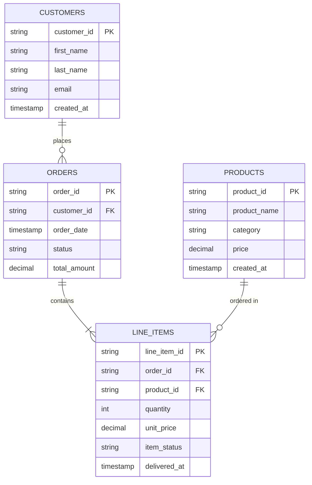
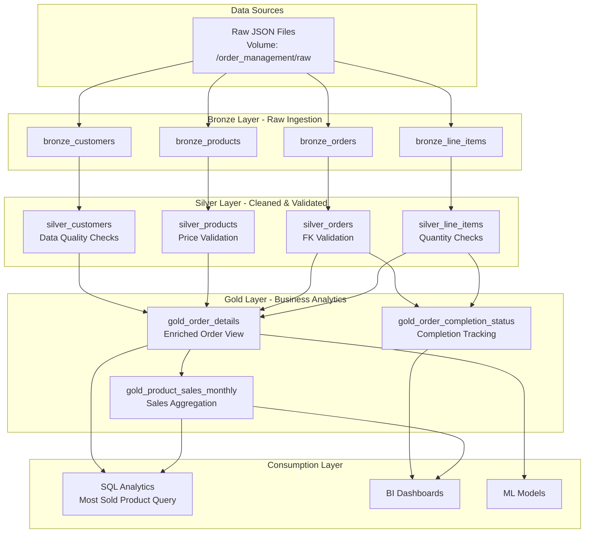

# Architecture Documentation

## Entity Relationship Diagram (ERD)

## Logical Architecture Diagram

## Architecture Patterns

### Medallion Architecture
The pipeline implements the Medallion Architecture pattern with three layers:

1. **Bronze Layer**: Raw data ingestion
   - Auto Loader (cloudFiles) for scalable file ingestion
   - Streaming data from JSON files
   - Minimal transformations

2. **Silver Layer**: Cleaned and validated data
   - Data quality expectations (expect_or_drop)
   - Schema enforcement with explicit casting
   - Invalid records dropped automatically

3. **Gold Layer**: Business-level aggregates
   - Enriched views joining multiple entities
   - Pre-computed aggregations for analytics
   - Optimized for consumption

### Data Quality
- Expectation checks at Silver layer
- NULL validation for primary and foreign keys
- Business rule validation (price > 0, quantity > 0, valid email format)
- Dropped records logged for auditing

### Order Completion Logic
Orders are marked as "Completed" when ALL line items have `item_status = 'delivered'`. This is implemented in the `gold_order_completion_status` table which:
- Counts total items per order
- Counts delivered items per order
- Sets `all_items_delivered = True` when counts match
- Provides completion status: "Completed", "Partially Delivered", or "Pending"

## Technology Stack
- **Databricks Lakeflow (DLT)**: Declarative pipeline framework
- **Delta Lake**: Storage layer with ACID transactions
- **Apache Spark**: Distributed processing engine
- **Auto Loader**: Incremental file ingestion
- **Databricks Asset Bundles**: CI/CD deployment
