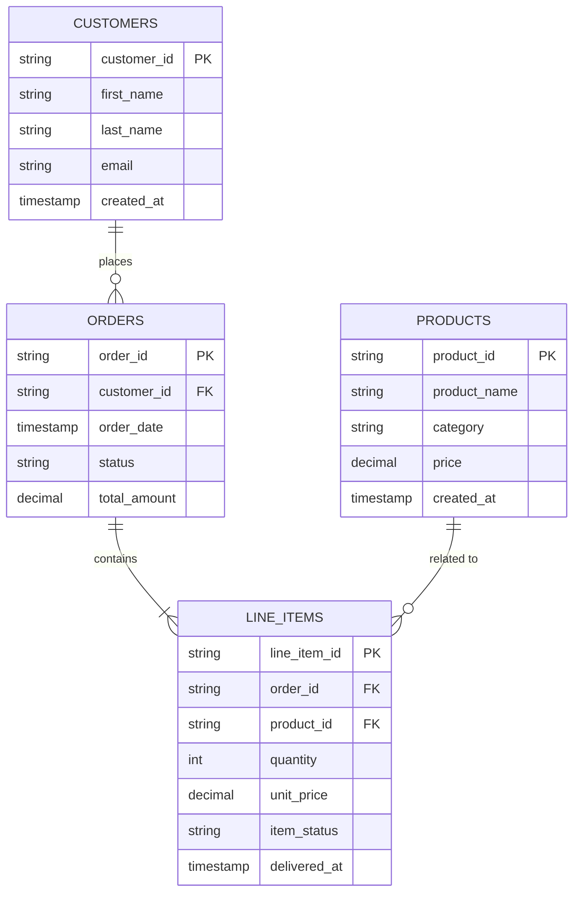
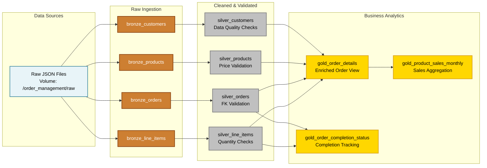

# Architecture Documentation

## Entity Relationship Diagram (ERD)

```mermaid
erDiagram
    CUSTOMERS ||--o{ ORDERS : places
    ORDERS ||--|{ LINE_ITEMS : contains
    PRODUCTS ||--o{ LINE_ITEMS : "related to"

    CUSTOMERS {
        string customer_id PK
        string first_name
        string last_name
        string email
        timestamp created_at
    }

    PRODUCTS {
        string product_id PK
        string product_name
        string category
        decimal price
        timestamp created_at
    }

    ORDERS {
        string order_id PK
        string customer_id FK
        timestamp order_date
        string status
        decimal total_amount
    }

    LINE_ITEMS {
        string line_item_id PK
        string order_id FK
        string product_id FK
        int quantity
        decimal unit_price
        string item_status
        timestamp delivered_at
    }
```

## Logical Architecture Diagram

```mermaid
graph LR
    subgraph "Data Sources"
        A[Raw JSON Files<br/>Volume: /order_management/raw]
    end

    subgraph "Raw Ingestion"
        B1[bronze_customers]
        B2[bronze_products]
        B3[bronze_orders]
        B4[bronze_line_items]
    end

    subgraph "Cleaned & Validated"
        C1[silver_customers<br/>Data Quality Checks]
        C2[silver_products<br/>Price Validation]
        C3[silver_orders<br/>FK Validation]
        C4[silver_line_items<br/>Quantity Checks]
    end

    subgraph "Business Analytics"
        D1[gold_order_details<br/>Enriched Order View]
        D2[gold_product_sales_monthly<br/>Sales Aggregation]
        D3[gold_order_completion_status<br/>Completion Tracking]
    end

    A --> B1
    A --> B2
    A --> B3
    A --> B4

    B1 --> C1
    B2 --> C2
    B3 --> C3
    B4 --> C4

    C1 --> D1
    C2 --> D1
    C3 --> D1
    C4 --> D1

    D1 --> D2
    C3 --> D3
    C4 --> D3

    classDef bronzeStyle fill:#CD7F32,stroke:#8B4513,stroke-width:2px,color:#fff
    classDef silverStyle fill:#C0C0C0,stroke:#808080,stroke-width:2px,color:#000
    classDef goldStyle fill:#FFD700,stroke:#DAA520,stroke-width:2px,color:#000
    classDef sourceStyle fill:#E8F4F8,stroke:#4A90A4,stroke-width:2px,color:#000

    class B1,B2,B3,B4 bronzeStyle
    class C1,C2,C3,C4 silverStyle
    class D1,D2,D3 goldStyle
    class A sourceStyle
```
